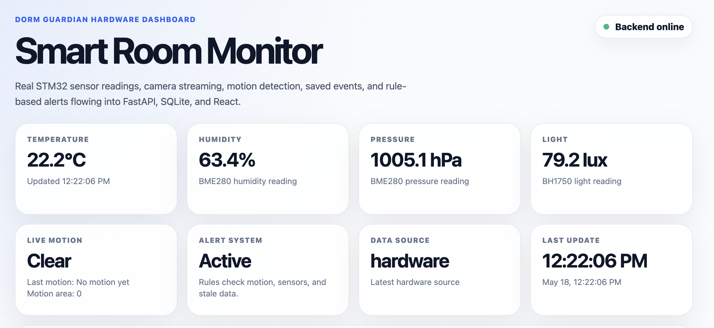
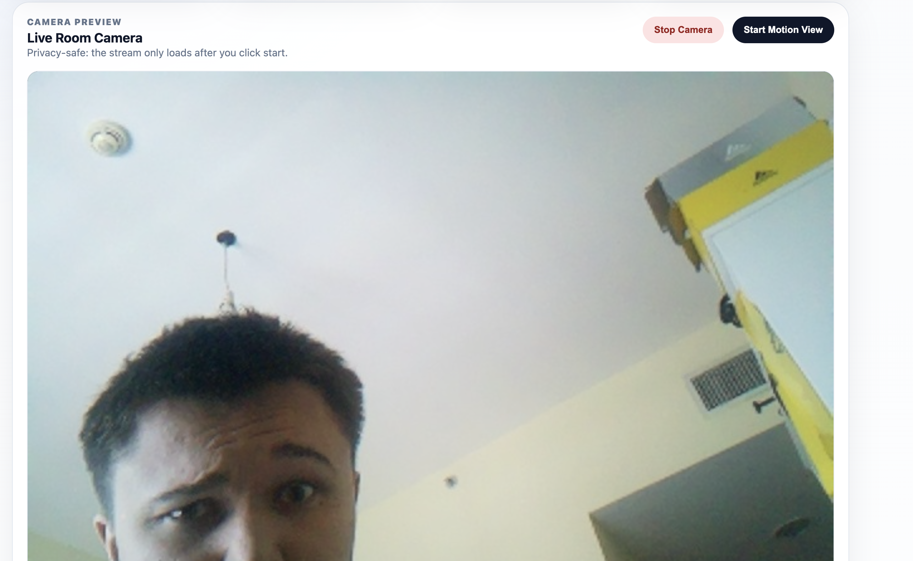
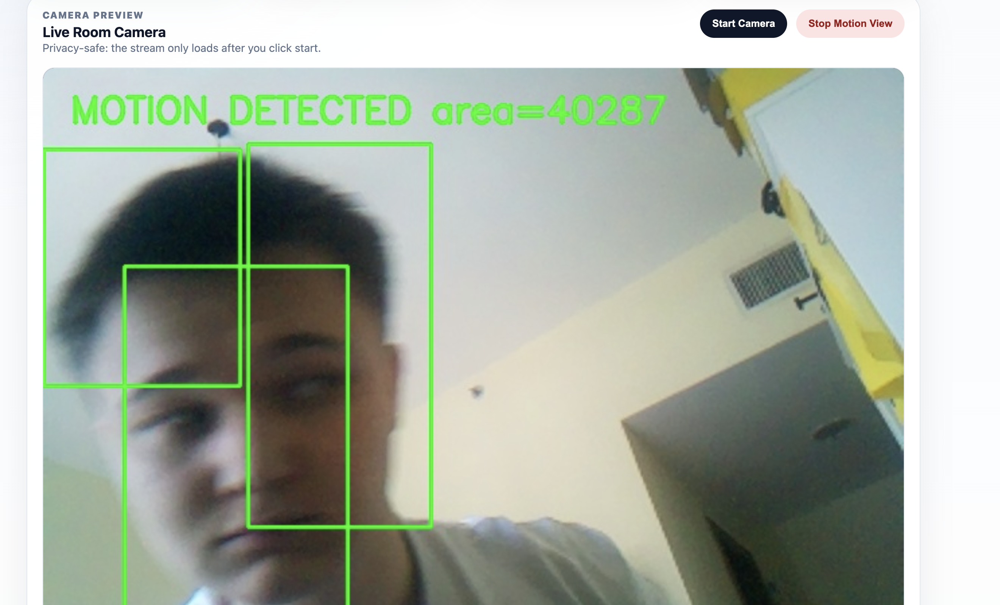

# Dorm Guardian / Smart Room Guardian

A student portfolio project that combines embedded systems, backend development, computer vision, local data storage, Raspberry Pi deployment, and a live web dashboard into one smart room monitoring system.

The project runs on a Raspberry Pi and auto-starts on boot using systemd services.

## What it does

Dorm Guardian monitors a room using:

- STM32 sensor firmware
- BME280 temperature, humidity, and pressure readings
- BH1750 light readings
- USB serial data transfer from STM32 to Raspberry Pi
- Python serial collector
- SQLite local database
- FastAPI backend
- React + TypeScript dashboard
- Raspberry Pi Camera / Picamera2 stream
- OpenCV motion detection
- Saved motion events
- Rule-based alerts
- systemd auto-start deployment

## Demo

### Live dashboard



### Camera stream



### Motion detection



## Current status

Working Raspberry Pi MVP:

- STM32 reads real sensor data
- STM32 sends JSON over USB serial to Raspberry Pi
- Python collector stores readings in SQLite
- FastAPI exposes sensor, camera, motion, and alert endpoints
- React dashboard displays live readings and charts
- Raspberry Pi Camera preview works
- Motion detection stream works
- Motion events are saved to SQLite
- Alerts are generated from motion and sensor rules
- Backend auto-starts on Raspberry Pi boot
- Serial collector auto-starts on Raspberry Pi boot
- Frontend dashboard auto-starts on Raspberry Pi boot
- Dashboard is accessible on the local network

Paused:

- Fan automation is paused because the first fan driver module was likely damaged during testing.
- Public internet access is planned later using Cloudflare Tunnel or Tailscale.

## Architecture

```text
BME280 + BH1750
      ↓ I2C
STM32 Nucleo-F103RB
      ↓ USB Serial JSON
Raspberry Pi
      ↓
Python Serial Collector
      ↓
SQLite Database
      ↓
FastAPI Backend
      ↓
React Dashboard

Raspberry Pi Camera
      ↓
Picamera2 / OpenCV
      ↓
Motion Detection
      ↓
Motion Events + Alerts
      ↓
React Dashboard
```
## Raspberry Pi deployment

The Raspberry Pi runs three systemd services:

```text
dorm-guardian-backend.service
dorm-guardian-serial.service
dorm-guardian-frontend.service
```

Check service status:

```bash
systemctl --no-pager --full status dorm-guardian-backend dorm-guardian-serial dorm-guardian-frontend
```

Restart all services:

```bash
sudo systemctl restart dorm-guardian-backend dorm-guardian-serial dorm-guardian-frontend
```

View logs:

```bash
sudo journalctl -u dorm-guardian-backend -n 80 --no-pager
sudo journalctl -u dorm-guardian-serial -n 80 --no-pager
sudo journalctl -u dorm-guardian-frontend -n 80 --no-pager
```

Current local dashboard URL:

```text
http://rasppi4.local:5173
```

or by IP address:

```text
http://192.168.1.182:5173
```

Backend health endpoint:

```text
http://rasppi4.local:8000/api/health
```

The systemd service templates are stored in:

```text
deployment/systemd/
```
